<p align="center">
  
</p>

<h1 align="center">InternAI</h1>

<p align="center">
  <strong>Yapay zekâ destekli akıllı staj ve kariyer platformu</strong>
</p>

<p align="center">
  Doğru stajı bul, yapay zekâ ile daha güçlü başvur.
</p>

<p align="center">
  
  
  
  
  
</p>

---

## 🌐 Live Demo

Canlı ortamda sistemi tarayıcıdan deneyebilirsiniz:

🔗 **https://internai-fngvr2dgc-feyza.vercel.app**

Hesap oluşturup giriş yaptıktan sonra staj keşfi, CV analizi, AI başvuru asistanı, başvuru panosu ve ayarları kullanabilirsiniz.

---

## Overview

InternAI, üniversite öğrencileri ve yeni mezunların staj süreçlerini tek bir çalışma alanında yönetmesini sağlar. Klasik ilan listelerinin ötesinde; şehir bazlı keşif, Gemini ile CV analizi, ilana özel başvuru metinleri, başvuru takibi ve kariyer önerilerini bir araya getirir.

| | |
|---|---|
| **Problem** | Aynı CV ve ön yazıyla yapılan başvurular düşük uyum üretir; takip dağınık kalır. |
| **Çözüm** | Keşif → analiz → AI metin → takip → dashboard döngüsü. |
| **Slogan** | Doğru stajı bul, yapay zekâ ile daha güçlü başvur. |

### Veri kaynağı (şeffaflık)

MVP’de staj ilanları **temsili demo verisidir**; canlı bir staj API’sinden çekilmez. Amaç ürün akışını göstermektir. Veri erişimi `getInternships()` / `getInternshipById()` üzerinden yapılır ve ileride gerçek API’ye taşınmaya uygundur.

---

## ✨ Features

| Feature | Description |
|---------|-------------|
| **Authentication** | Firebase Authentication ile kayıt, giriş ve şifre sıfırlama |
| **Dashboard** | Özet istatistikler, hızlı işlemler ve kariyer çalışma alanı |
| **Internship Discovery** | Şehir / alan / model filtreleriyle staj kataloğu (demo veri) |
| **AI Resume Analysis** | PDF’den metin çıkarma, Gemini ile CV–ilan uyumu ve ATS tahmini |
| **AI Cover Letter Generation** | AI Başvuru Asistanı ile ön yazı, e-posta, mülakat ve motivasyon metinleri |
| **Applications Board** | Liste + Kanban ile başvuru takibi, not ve timeline |
| **AI Career Coach** | Mevcut veriden kural tabanlı kişiselleştirilmiş öneriler |
| **User Profile** | Hesap bilgisi ve kariyer kimliği alanı |
| **Settings** | Hesap tercihleri ve görünüm ayarları |
| **Notifications** | Firestore’a kaydedilen bildirim tercihleri (push yok; MVP tercih kaydı) |
| **Firebase Integration** | Auth + Firestore (bildirim ayarları vb.) |
| **Gemini AI Integration** | Sunucu tarafı Gemini API (`GEMINI_API_KEY`) |
| **Responsive Design** | Mobil ve masaüstü uyumlu arayüz |

> **Not:** Ayrı bir firma / admin paneli (çoklu kullanıcı yönetimi) bu MVP kapsamında yoktur; kullanıcı ayarları ve kişisel çalışma alanı mevcuttur.

---

## 🖼 Demo Screenshots

### Landing & Auth

| Landing | Login | Register |
|:---:|:---:|:---:|
| 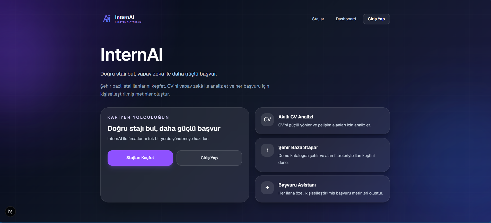 | 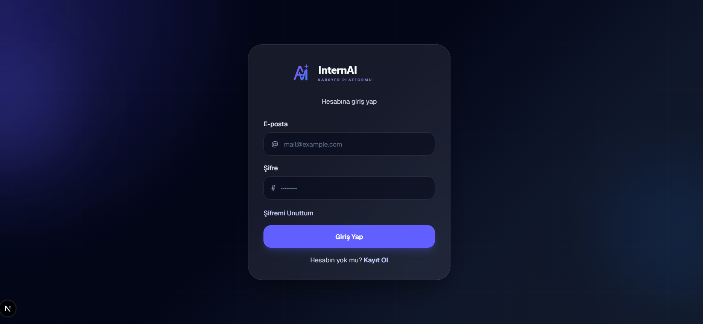 | 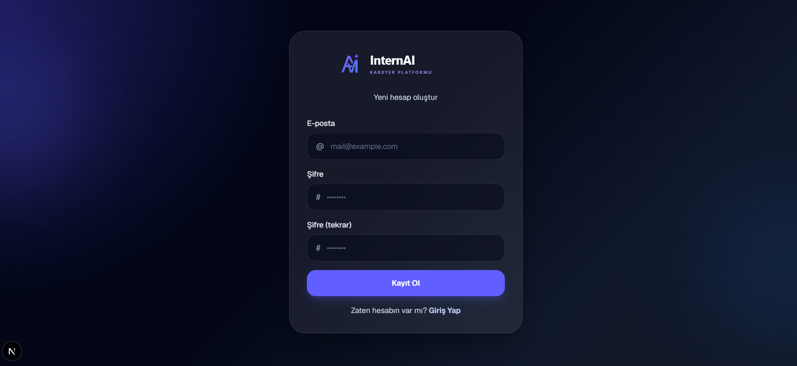 |

### Discovery & Profile

| Internships | Profile |
|:---:|:---:|
| 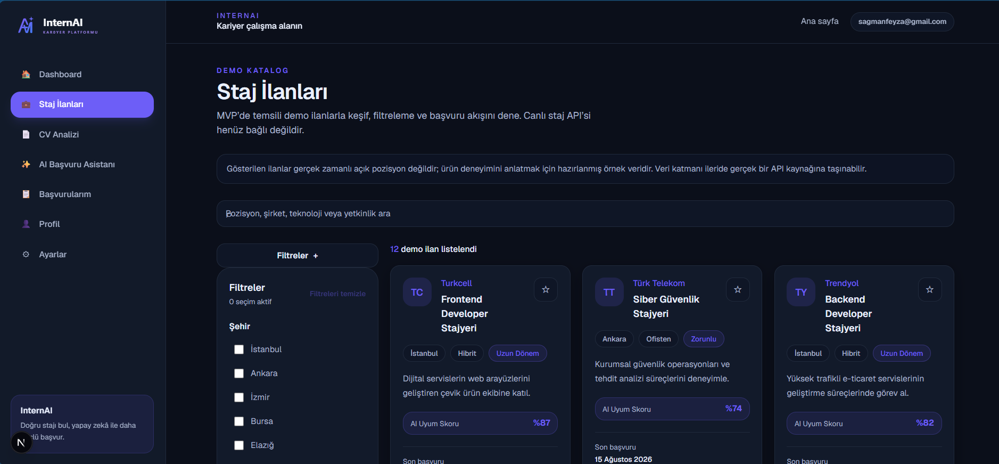 | 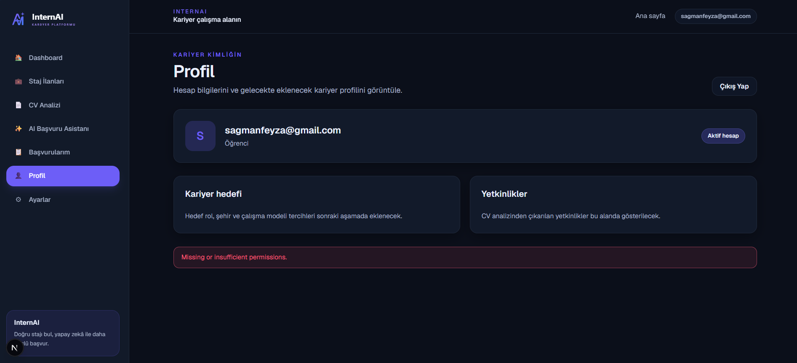 |

### AI Resume & Assistant

| Resume Upload | Resume Score | Application Assistant |
|:---:|:---:|:---:|
| 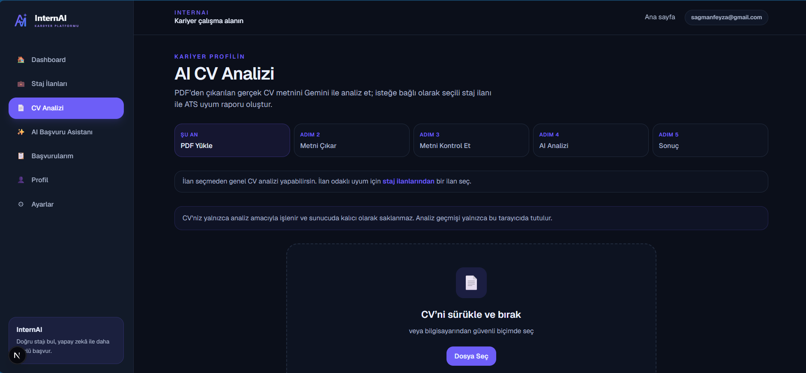 | 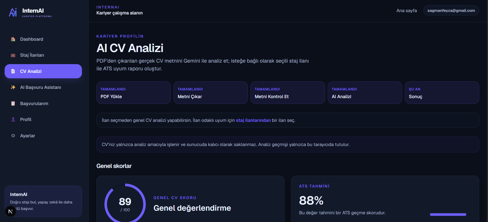 | 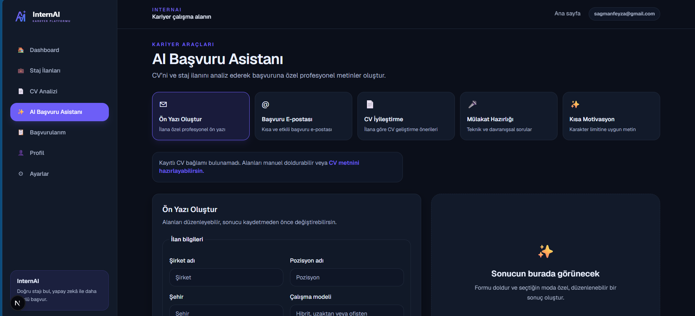 |

### Applications, Dashboard & Settings

| Applications | Final Dashboard | Settings |
|:---:|:---:|:---:|
| 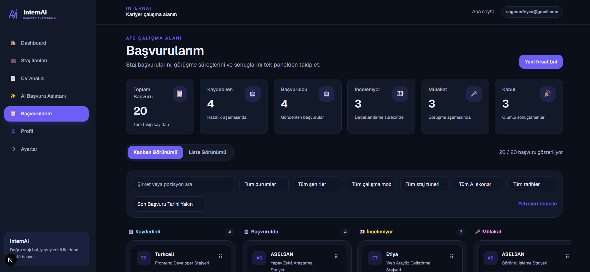 | 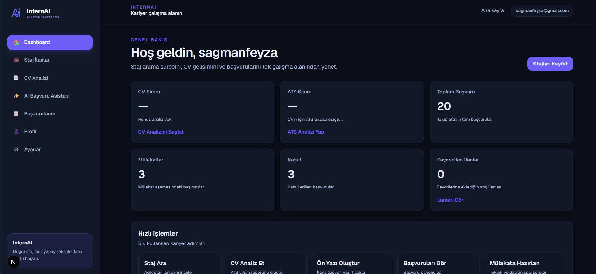 | 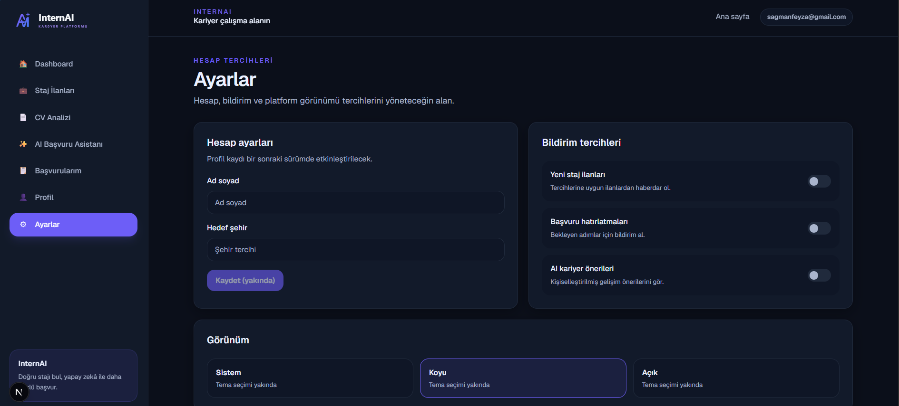 |

Tüm görseller: [docs/screenshots-organization-report.md](./docs/screenshots-organization-report.md)

---

## 🛠 Tech Stack

### Frontend

- Next.js 16
- React 19
- TypeScript
- Tailwind CSS 4

### Backend

- Firebase
- Cloud Firestore
- Firebase Authentication

### AI

- Google Gemini API (`@google/genai`)

### Deployment

- Vercel

---

## 📁 Project Structure

```text
YZTA_BOOTCAMP_TAKIM91/
├── README.md
├── firebase.json
├── firestore.rules
├── .firebaserc
├── docs/
│   ├── README.md
│   ├── branding/                 # Marka kimliği & tasarım referansı
│   ├── product/                  # Vizyon, backlog, özellikler, takım
│   ├── sprint-1/                 # Sprint 1 süreç + screenshots/
│   ├── sprint-2/                 # Sprint 2 süreç + screenshots/
│   ├── sprint-3/                 # Sprint 3 süreç + screenshots/
│   ├── duplicates/
│   ├── needs-review/
│   └── screenshots-organization-report.md
└── web-admin/                    # Next.js uygulaması
    ├── app/                      # App Router (sayfalar, API routes)
    ├── components/brand/         # BrandLogo
    ├── features/                 # Domain modülleri
    │   ├── ai-assistant/
    │   ├── applications/
    │   ├── career-coach/
    │   ├── dashboard/
    │   ├── internships/
    │   ├── resume-analysis/
    │   └── settings/
    ├── lib/                      # Firebase, AI, routes
    ├── public/brand/             # SVG logo & favicon
    ├── .env.example
    └── package.json
```

---

## 🚀 Getting Started

### Prerequisites

- Node.js 20+
- npm
- Firebase projesi (Auth + Firestore)
- Gemini API anahtarı (CV analizi ve asistan için)

### 1. Clone

```bash
git clone https://github.com/<your-username>/YZTA_BOOTCAMP_TAKIM91.git
cd YZTA_BOOTCAMP_TAKIM91
```

### 2. Install

```bash
cd web-admin
npm install
```

### 3. Environment

```bash
cp .env.example .env.local
```

`.env.local` içinde gerekli değişkenleri doldurun. Şablon: [`web-admin/.env.example`](./web-admin/.env.example)

| Değişken | Açıklama |
|----------|----------|
| `GEMINI_API_KEY` | Sunucu tarafı Gemini anahtarı |
| `NEXT_PUBLIC_FIREBASE_*` | Firebase web yapılandırması |

### 4. Run

```bash
npm run dev
```

Uygulama varsayılan olarak [http://localhost:3000](http://localhost:3000) adresinde açılır.

### 5. Build (opsiyonel)

```bash
npm run build
npm start
```

---

## 📚 Documentation

| Bölüm | Bağlantı |
|-------|----------|
| Dokümantasyon ana sayfa | [docs/README.md](./docs/README.md) |
| Product Backlog | [docs/product/product-backlog.md](./docs/product/product-backlog.md) |
| Ürün vizyonu | [docs/product/product-vision.md](./docs/product/product-vision.md) |
| Ürün özellikleri | [docs/product/product-features.md](./docs/product/product-features.md) |
| Takım ve roller | [docs/product/team-and-roles.md](./docs/product/team-and-roles.md) |
| Branding | [docs/branding/README.md](./docs/branding/README.md) |
| Sprint 1 | [docs/sprint-1/README.md](./docs/sprint-1/README.md) |
| Sprint 2 | [docs/sprint-2/README.md](./docs/sprint-2/README.md) |
| Sprint 3 | [docs/sprint-3/README.md](./docs/sprint-3/README.md) |

### Sprint özetleri

| Sprint | Hedef | Özet |
|--------|-------|------|
| **Sprint 1** | Altyapı ve temel ürün iskeleti | [README](./docs/sprint-1/README.md) |
| **Sprint 2** | CV ve başvuru metni süreçleri | [README](./docs/sprint-2/README.md) |
| **Sprint 3** | Ürün bütünlüğü ve finalizasyon | [README](./docs/sprint-3/README.md) |

---

## 🗺 Roadmap

- GitHub / LinkedIn profil analizi
- Bulut senkronizasyonu (başvuru / CV geçmişi)
- Firma paneli ve istatistikler
- Daha zengin kariyer yol haritası
- Portföy değerlendirme

---

## 👥 Team

Bu proje **Takım 91** kapsamında geliştirilmiştir.

| Rol | Kişi |
|-----|------|
| Product Owner | Feyza Sağman |
| Scrum Master | Feyza Sağman |
| Developer | Feyza Sağman |

Ayrıntı: [docs/product/team-and-roles.md](./docs/product/team-and-roles.md)

---

## 📝 Notes

Diğer GitHub reposu: https://github.com/melismert805-ui/YZTA--Team-91

Ekip arkadaşlarım ile formu doldurduktan sonra iletişim kuramadım; mesajlara dönüş alamadım ve ilgili GitHub reposuna Scrum Master tarafından eklenmediğim için süreci **bu repoda tek başıma** tamamlıyorum.
